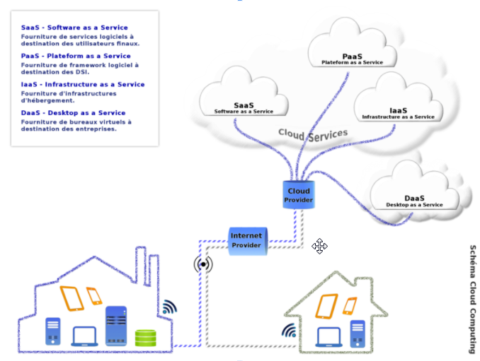
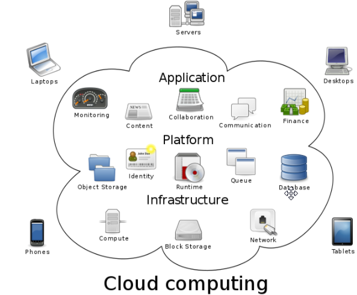
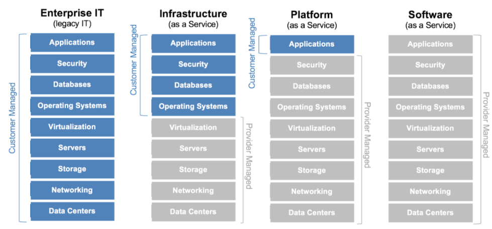
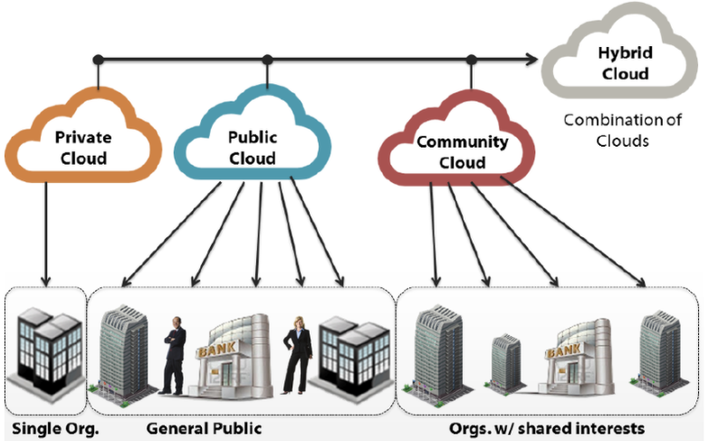
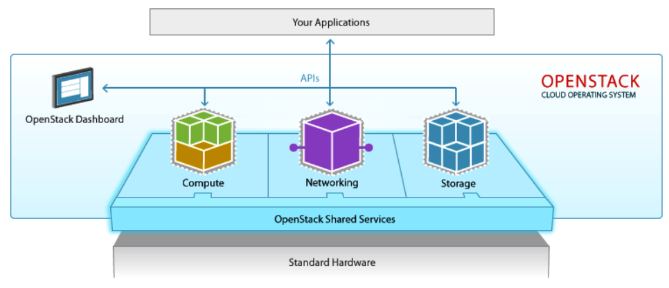
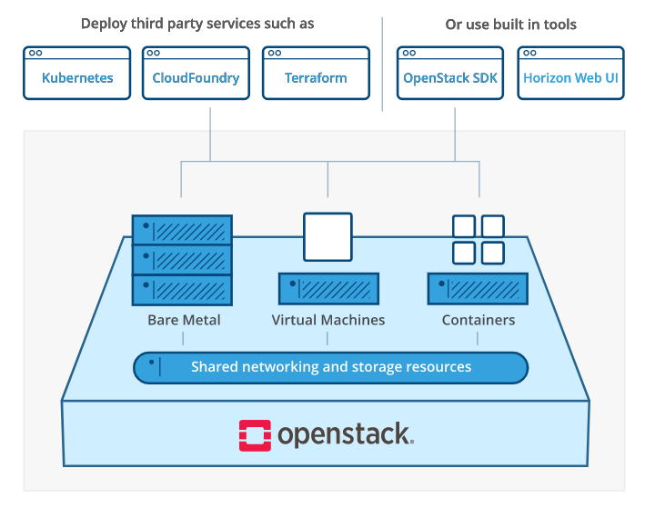
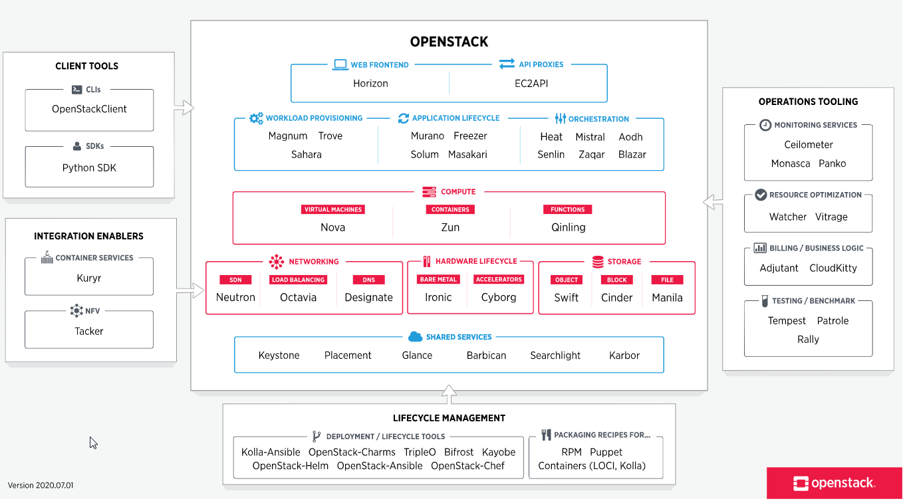

# An introduction to Cloud

This is more an awareness and vocabulary presentation.

## What is Cloud Computing

Different type of Cloud computing :

## Services in the Cloud

* On demand self-service
* Broad network access
* Resource pooling
* Rapid elasticity
* Measured service

## Cloud offer and service provided 

## Different Cloud deployment

The need to have common Cloud service deployment in both Public and Private Cloud explain the rise of Kubernetes.
Kubernetes address one crucial risk for companies: lock-in. Having the same deployment infrastructure target, 
the companies can move from Public to Private Cloud or create Hybrid CLoud.

## Quizz

!!! question
    Which cloud delivery type below abstracts runtime infrastructure, middleware and operating system in addition to compute, network and storage resources?

    * IaaS
    * PaaS
    * SaaS

!!! question
    Which one of the following is not an essential characteristic of cloud computing?

    * On demand self-service
    * Rapid elasticity
    * Measured service
    * Open source
    * Resource pooling
    * Broad network access

## Quick openstack presentation

### What is Openstack ?

* Open source software for creating private and public clouds (OVH for example)
* Compute, storage, and networking
* Huge demand for expertise 

!!! success
    OpenStack is one of the top 3 most active open source projects (Python) and manages 15 million compute cores
    You can have a better idea of project size looking at: [Openstack User Stories](https://www.openstack.org/user-stories/)

OpenStack is a cloud operating system that controls large pools of compute, storage, and networking resources throughout a datacenter, +
all managed and provisioned through APIs with common authentication mechanisms.

A dashboard is also available, giving administrators control while empowering their users to provision resources through a web interface. +

Beyond standard infrastructure-as-a-service functionality, additional components provide orchestration, fault management and service management amongst other services to ensure high availability of user applications. +

### Openstack Hypervisors
OpenStack Compute (nova) supports many hypervisors to various degrees, including:

* KVM
* LXC
* QEMU
* VMware ESX/ESXi
* Xen
* Hyper-V
* Docker

### Openstack full picture

Give a better idea of the project size :

###Is OpenStack Dead 2020?
Yes, OpenStack is still alive and well, and it continues to evolve with interesting new features,
like [StarlingX](https://www.starlingx.io/).
But many of the vendors that originally specialized in OpenStack, such as Mirantis, have now shifted their attention to Kubernetes.
Others, like SUSE, have dropped out of the OpenStack market altogether. SUSE bought Rancher in mid 2020.