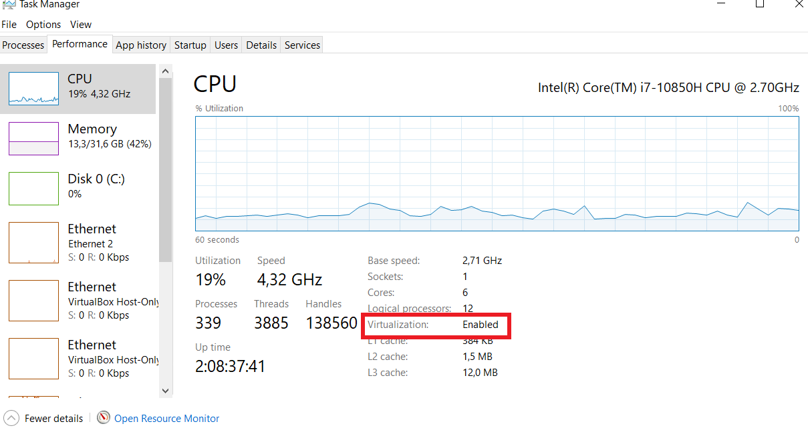

# Requirements for labs

All the pre-requisites to follow the labs

## System pre-requisites
You need to be on Windows (7+), Linux or MacOS.

**VT-x/AMD-v virtualization must be enabled in BIOS**

### check with Windows 10 task manager


!!! Note
    We will need Windows 10 for Wsl2 and Docker Desktop in future sections

!!! Warning
    You need the Administrative rights to be able to install software  
    Don't forget to switch to admin command on Windows

## Windows recommended pre-requisite
We recommend installing {==chocolatey==} Windows package manager to make it easy.  
Read this [Why chocolatey](https://docs.chocolatey.org/en-us/why)

If you are convinced, please follow this: [Install chocolatey]( https://chocolatey.org/courses/installation/installing?method=installing-chocolatey#cmd )

To see software installed locally:
```bash
   choco list -l
```   

To search a package remotely:
```bash
   choco search <package_name>
```

For people allergic to command prompt ( bad for automation from my point of view ), there is a chocolaty GUI.

### Software needed 

You need to install this list of software

* Vagrant - to build and manage virtual machines easily. This will "pilot" virtualbox. 
  
* Oracle Virtualbox - the famous Type 2 hypervisor

* (Windows only) Mobaxterm - a beautiful cygwin package toolbox - an alternative to putty

## Windows installation
We do recommend also to install git, to clone source on your computer.

```bash
   choco install -y mobaxterm vagrant git
```

!!! Note
    We advise installing virtualbox manually instead of using chocolatey  
    Url: [Virtualbox download](https://www.virtualbox.org/wiki/Downloads)

## Issues
### Windows 11 family issue

Links:  

* [vt-x-enabled-in-bios-but-not-working-in-windows-11](https://answers.microsoft.com/en-us/windows/forum/all/vt-x-enabled-in-bios-but-not-working-in-windows-11/50dfaa81-5485-45a6-b803-9124f553f32e?page=2)

Seems the solution is to: **disable Core isolation in Windows Security**  

* To disable core isolation: [vt-x-enabled-in-bios-but-not-working-in-windows-11](https://support.microsoft.com/en-us/windows/options-to-optimize-gaming-performance-in-windows-11-a255f612-2949-4373-a566-ff6f3f474613)

