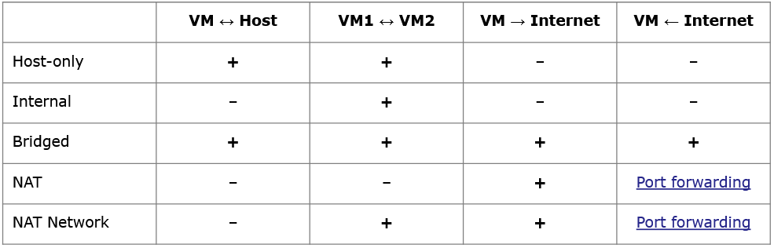
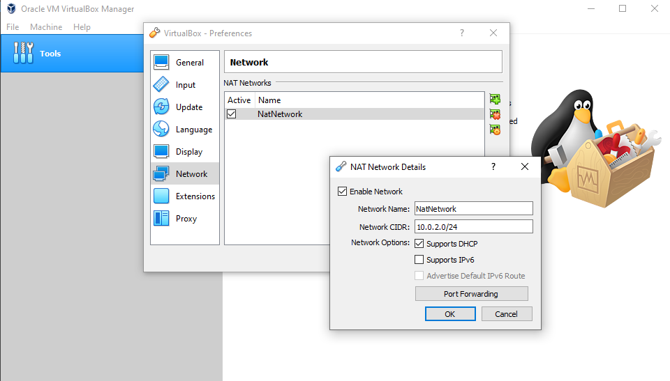

# Virtualbox software

## Virtualbox network configuration

Comes from [Virtualbox Network configuration](https://www.virtualbox.org/manual/ch06.html)

## Configure the NAT network

!!! Note
    RFC 1918 - the following IP ranges are reserved for private networks

    - 10.0.0.0/8     – 10.255.255.255 
    - 172.16.0.0/12  - 172.31.255.255 
    - 192.168.0.0/16 - 192.168.255.255

    They are not routable on global internet

Here a good online tool to calculate network: https://www.ipaddressguide.com/cidr