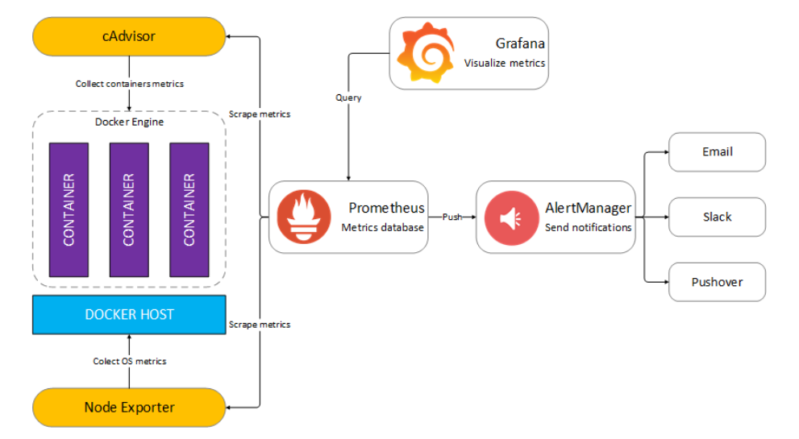

# Docker compose

Compose is a tool for defining and running ==multi-container Docker applications==. 
With Compose, you use a ==YAML== file to configure your application’s services. 
Then, with a single command, you create and start all the services from your configuration

## Links

* [Overview of Docker compose](https://docs.docker.com/compose/)
* [Docker compose release](https://github.com/docker/compose/releases)

Install docker-compose executable.  
Then install the docker-compose.yaml file to execute.

## Labs 1: Wordpress

Please follow the "Compose and Wordpress" quickstart.  
[wordpress url](https://docs.docker.com/samples/wordpress/)

``` yaml
version: "3.9"
    
services:
  db:
    image: mysql:5.7
    volumes:
      - db_data:/var/lib/mysql
    restart: always
    environment:
      MYSQL_ROOT_PASSWORD: somewordpress
      MYSQL_DATABASE: wordpress
      MYSQL_USER: wordpress
      MYSQL_PASSWORD: wordpress
    
  wordpress:
    depends_on:
      - db
    image: wordpress:latest
    volumes:
      - wordpress_data:/var/www/html
    ports:
      - "8000:80"
    restart: always
    environment:
      WORDPRESS_DB_HOST: db
      WORDPRESS_DB_USER: wordpress
      WORDPRESS_DB_PASSWORD: wordpress
      WORDPRESS_DB_NAME: wordpress
volumes:
  db_data: {}
  wordpress_data: {}
 ```


## Labs 2: A complete monitoring infrastructure

We will deploy this :



The project URL is this one : [dockprom](https://github.com/stefanprodan/dockprom)
 
