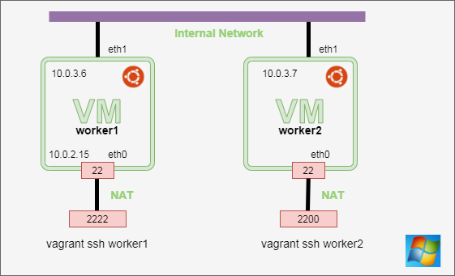

# Quick Day1 summary

## Vagrant - multi machine
Link : https://github.com/omerlin/yncrea-virtualization-labs

Schema:



!!! Note
    Drawing done with https://app.diagrams.net/

`LABS` Restart the TwoBoxes using vagrant

### Reminder on VBOXmanager:

* vboxmanage command (See cheatsheet)
* Snapshot of machine
* Restore of machine snapshot

`LABS` : update your VM
* Update the Ubuntu OS
* Stop the VMs
* Take a snapshot of the 2 boxes

### Mobaxterm aliases reminder
You can connect using:
```
vagrant ssh worker 1
```

File ~/.ssh/config to define a SSH alias

```bash
cd $(cygpath 'C:\dev\yncrea\yncrea-virtualization-labs')
cd TwoBoxes/
#To list the private keys generated by Vagrant
find . -name "private*"
# Copy the keys in the local .ssh store
cp ./.vagrant/machines/worker1/virtualbox/private_key ~/.ssh/worker1.pk
cp ./.vagrant/machines/worker2/virtualbox/private_key ~/.ssh/worker2.pk
```

Then you need to configure aliases in the ~/.ssh/config file
```
Host worker1
HostName 127.0.0.1
User vagrant
Port 2222
UserKnownHostsFile /dev/null
StrictHostKeyChecking no
PasswordAuthentication no
IdentityFile ~/.ssh/worker1.pk

Host worker2
HostName 127.0.0.1
User vagrant
Port 2200
UserKnownHostsFile /dev/null
StrictHostKeyChecking no
PasswordAuthentication no
IdentityFile ~/.ssh/worker2.pk
```

`LAB` Do the configuration and test it 

## Docker

### Basic of Docker & Docker slimming
Just a reminder of basics

### `LABS` build and execute a small nodeJS application

* Start worker1 for instance
* You need to clone the link in one VM

```
git clone https://github.com/omerlin/yncrea-virtualization-labs.git
cd yncrea-virtualization-labs
```
Then you have to:

* build the docker image
* start the image (don't forget to expose the port)
* test the image from a browser

### Pushing image to a repository 

!!! warning
    You need to have an account on https://hub.docker.com

```bash
docker images
# You get the image id you built locally
docker tag <<image_id>>>> omerlin/nodeapp:v01
docker login -u omerlin
docker push omerlin/nodeapp:v01
```

### Docker compose
We will redo a quick labs on it
Still on worker1, go to the ==yncrea-virtualization-labs== git project

First, you need to get [docker-compose binary](https://github.com/docker/compose/releases)
You need to add this binary in your /usr/local/bin directory.

Now, we will update the small nodejs application, to persist data in a Mysql database.

Look ==carefully== at the `docker-compose.yml` file.

```yaml linenums="1"
version: "3"
services:
  web:
    build: .
    # image: omerlin/node-app:1.0
    command: node index-db.js
    ports:
      - "3000:3000"
    restart: on-failure
    environment:
      MYSQL_DATABASE: myapp
      MYSQL_USER: myapp
      MYSQL_PASSWORD: mysecurepass
      MYSQL_HOST: db
  db:
    image: woahbase/alpine-mysql:x86_64
    expose:
      - "3306"
    environment:
      MYSQL_ROOT_PWD: insecurebydefault
      MYSQL_USER_DB: myapp
      MYSQL_USER: myapp
      MYSQL_USER_PWD: mysecurepass
```
* `line 4` : it's better to put the build image name
* `line 9` : without this ==restart: on-failure==, it fails as the Node program start before the database up and running
* `line 14`: this refers the ==db== container 
* `line 17`: we ==expose== the port on the docker network not to ==external access==, like the "port" entry on `line 7`

!!! Note
    You may have remarked all the images are Alpine based images

`LAB` Make it working ... There is a small trap :smile:

