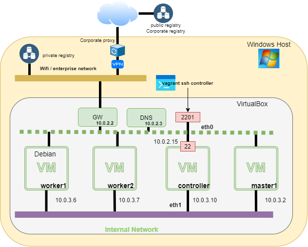
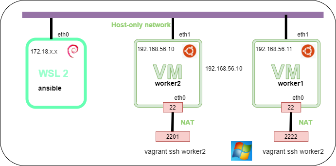

# Quick Day1 summary

## Vagrant - multi machine using Debian buster64
Link : https://github.com/omerlin/yncrea-virtualization-labs/tree/main/vagrant/buster64

Schema:



!!! Note
    Drawing done with [drawio tool](https://app.diagrams.net/)  
    Portable version here: [drawio portable version](https://portapps.io/app/drawio-portable/)  
    The above PNG file example: [Virtualbox network with 4 Debian machines - Drawio](../files/virtualization/vagrant_multi_buster64.drawio)

`LABS` Restart the buster64 labs using vagrant

### Reminder on VBOXmanager:

* vboxmanage command (See [cheatsheet VBOXManage](https://omerlin.github.io/yncrea-virtualization/cheatsheets/vboxManage) )
* Snapshot of machine
* Restore of machine snapshot

`LABS` : update your VM

   * Update the Debian OS (`apt-get update`)
   * Stop the VMs
   * Take a snapshot of the all your boxes

### Reminder on MobaXterm installation

Get the **portable** version, install it and define a location for home directory (in settings/General)

### Mobaxterm aliases reminder
You can connect using 3 ways:  
* using the GUI
* using vagrant command ```vagrant ssh```
* using ```VboxManage startvm```

!!! Question
    **VBoxManage** is the best option - tell me why ? :Like:
   
!!! Tip
    To start all the VM from a bash script (mobaXterm for instance)  

    ```bash
       # bash way to start all the Vms  
       for k in `vboxmanage list vms | cut -d '"' -f 2`; do vboxmanage startvm $k --type headless; done  
       # Same to stop all the Vms cleanly  
       for k in `vboxmanage list runningvms | cut -d '"' -f 2`; do vboxmanage controlvm $k poweroff soft; done  
    ```

!!! Reminder
    ```powershell
       # powershell
       vboxmanage showvminfo controller --details| select-string 'Nic 1 rule'
    ```
    or in bash, to get only port:
    ```bash
      # bash
      vboxmanage showvminfo controller --details| grep 'NIC 1 Rule'|cut -d ',' -f 4|cut -d '=' -f 2|xargs
      
      # all the boxes port
      for k in `vboxmanage list vms| cut -d '"' -f 2`; do port=$(vboxmanage showvminfo $k --details| grep 'NIC 1 Rule'|cut -d ',' -f 4|cut -d '=' -f 2|xargs); echo "$k -- $port";done

    ```

File **~/.ssh/config** to define a SSH alias on Linux.  

```bash
# This path depends n your installation 
cd $(cygpath $USERPROFILE)/MyApp/yncrea-virtualization-labs/vagrant/buster64

# Get private keys and copy them in $HOME/.ssh directory
for k in `find . -name "private*"`; do t=$( echo $k|cut -d '/' -f 4 ); cp -f $k ~/.ssh/id_$t; done
```

Then you need to configure aliases in the ~/.ssh/config file
```
UserKnownHostsFile /dev/null
StrictHostKeyChecking no
PasswordAuthentication no
IdentitiesOnly yes
LogLevel INFO

Host controller c1
HostName 127.0.0.1
User vagrant
Port 2202
IdentityFile ~/.ssh/id_controller
LocalForward 8000 localhost:8000

```

`LAB` Do the configuration and test it 

## Alternative: Host-only network
One may advantage: you can interract directly with the Host and thus be reachable from WSL 2 VM.  
As WSL2 VM are very light this is a great advantage.  



To configure it it's easy. You need a Host network.  
This can be created with the GUI or :  
```
vboxmanage hostonlyif create
vboxmanage list hostonlyifs
```
then  you re-create your vagrant image (or update - but not tested) so to use 

```ruby hl_lines="6 7"
Vagrant.configure(2) do |config|
  config.vm.define "controller" do |worker|
  worker.vm.allow_hosts_modification = true
  worker.vm.hostname = "controller"
  worker.vm.box = "bionic64"
    worker.vm.network "private_network", ip: "192.168.83.10",
      name: "VirtualBox Host-Only Ethernet Adapter"
    worker.vm.provision "shell", path: "../scripts/install.sh"
    worker.vm.provider "virtualbox" do |v|
      v.name = "controller"
      v.memory = 1024
      v.cpus = 1
    end
    end
end
```


## Docker

### Basic of Docker & Docker slimming
Just a reminder of basics  
Reminds also about the docker network labs  

### `LABS` build and execute a small nodeJS application

* Start worker1 for instance
* You need to clone the link in one VM

```
git clone https://github.com/omerlin/yncrea-virtualization-labs.git
cd yncrea-virtualization-labs
```
Then you have to:

* build the docker image
* start the image (don't forget to expose the port)
* test the image from a browser

### Pushing image to a repository 

!!! warning
    You need to have an account on https://hub.docker.com

```bash
docker images
# You get the image id you built locally
docker tag <<image_id>>>> omerlin/nodeapp:v01
docker login -u omerlin
docker push omerlin/nodeapp:v01
```

### Docker compose
We will redo a quick labs on it
Still on worker1, go to the ==yncrea-virtualization-labs== git project

Install docker-compose in your Linux box (worker1 for instance), using:  

```bash
sudo apt install docker-compose
```

Now, we will update the small nodejs application, to persist data in a Mysql database.

Look ==carefully== at the `docker-compose.yml` file.

```yaml linenums="1"
version: "3"
services:
  web:
    build: .
    # image: omerlin/node-app:1.0
    command: node index-db.js
    ports:
      - "3000:3000"
    restart: on-failure
    environment:
      MYSQL_DATABASE: myapp
      MYSQL_USER: myapp
      MYSQL_PASSWORD: mysecurepass
      MYSQL_HOST: db
  db:
    image: woahbase/alpine-mysql:x86_64
    expose:
      - "3306"
    environment:
      MYSQL_ROOT_PWD: insecurebydefault
      MYSQL_USER_DB: myapp
      MYSQL_USER: myapp
      MYSQL_USER_PWD: mysecurepass
```

| Line        | Description                              |
| ----------- | ---------------------------------------- |
| `line 4`    | it's better to put the build image name  |
| `line 9`    | without this ==restart: on-failure==, it fails as the Node program start before the database up |
| `line 14`   | this refers the `db` container |
| `line 17`   | we ==expose== the port for other pods in the overlay network |

!!! Note
    You may have remarked all the images are Alpine based images

`LAB` Make it working ... There is a small trap :smile:

