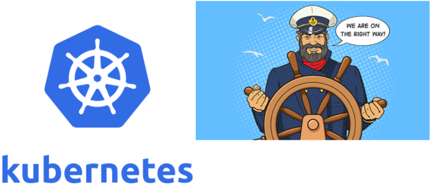
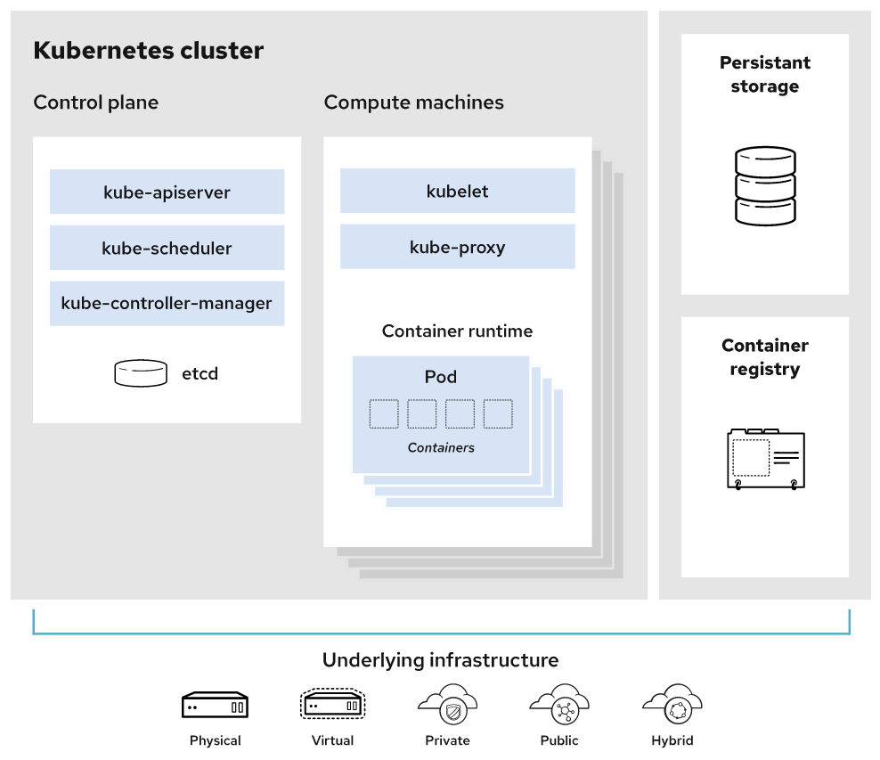

# Kubernetes introduction

## What is Kubernetes?
To begin to understand the usefulness of Kubernetes, we have to first understand two concepts: 
{==immutable infrastructure==} and {==containers==}.

* {==Immutable infrastructure==} is a practice where servers, once deployed, are never modified.
  If something needs to be changed, you never do so directly on the server. 
  Instead, you’ll build a new server from a base image, that have all your needed changes baked in. 
  This way we can simply replace the old server with the new one without any additional modification.
* {==Containers==} offer a way to package code, runtime, system tools, system libraries, and configs altogether.
  This shipment is a lightweight, standalone executable. 
  This way, your application will behave the same every time no matter where it runs (e.g, Ubuntu, Windows, etc.). 
  Containerization is not a new concept, but it has gained immense popularity with the rise of microservices and Docker.

Armed with those concepts, we can now define Kubernetes as a {=container or microservice platform=} 
that ==*orchestrates*== computing, networking, and storage infrastructure workloads. 
Because it doesn’t limit the types of apps you can deploy (any language works), Kubernetes extends how we scale containerized applications 
so that we can enjoy all the benefits of a truly {==immutable infrastructure==}. 
The general rule of thumb for K8S: **"if your app fits in a container, Kubernetes will deploy it."**

!!! info
    
    By the way, if you’re wondering where the name “Kubernetes” came from, it is a Greek word, 
    meaning **helmsman** or **pilot**. 
    The abbreviation ==K8s== is derived by replacing the eight letters of “ubernete” with the digit 8.

The Kubernetes Project was open-sourced by Google in 2014 after using it to run production workloads at scale for more than a decade. (Borg project) 
Kubernetes provides the ability to :

* run dynamically scaling, containerised applications,
* utilising an API for management. 
  
Kubernetes is a :

* {==vendor-agnostic==} (no lock-in) container management tool, 
* minifying cloud computing costs whilst simplifying the running of resilient and scalable applications.

Kubernetes has become {==**the standard**==} for running containerised applications in the cloud, 
with the main Cloud Providers (AWS, Azure, GCE, IBM and Oracle) now offering managed Kubernetes services.

| Provider         | Kubernetes offer              |
| :--------------- | :---------------------------- |
| `AWS`            | EKS  |
| `Azure`          | AKS  |
| `GCE`            | GKE  |
| `IBM`            | IBM Cloud Kubernetes Service  |
| `Oracle`         | OKE  |
| `Scaleway`       | Kubernetes Kapsule & Kosmos  |
| `Digital Ocean`  | Kubernetes Kapsule & Kosmos  |
| (...)            | (...) |

Kubernetes simplifies interoperability opening door to `multi-cloud`

## The success of Kubernetes
From an enterprise  survey (2020) done by VMware in United States, the prevailing sentiment is that Kubernetes won.
59% of the surveyed companies are using Kubernetes in prtoduction.
Some takeway from the survey:

### why ?
* 56% of respondents using Kubernetes saw improved resource utilization
* 53% saw shortened development cycles with Kubernetes
* 50% found that it helped to containerize monolithic apps
* 42% said that it enabled the organization to move to the cloud
* 33% found that it reduced public cloud costs

Only 5% found it was not affording an improvement.

### where ?
* 64% of respondents deploy Kubernetes on-premises
* 42% run it with a single, public cloud vendor
* 31% utilize multiple public cloud vendors
* 10% use distributed edge locations

## Kubernetes basic terms and definitions
To begin understanding how to use K8S, we must understand the objects in the API. 
Basic K8S objects and several higher-level abstractions are known as controllers. 
These are the building block of your application lifecycle.

### Some Basic objects

* {==Pod==}. A group of one or more containers.
* {==Service==}. An abstraction that defines a logical set of pods as well as the policy for accessing them.
* {==Volume==}. An abstraction that lets us persist data. (This is necessary because containers are ephemeral—meaning data is deleted when the container is deleted.)
* {==Namespace==}. A segment of the cluster dedicated to a certain purpose, for example a certain project or team of devs.

###Some Controllers, or higher-level abstractions

* {==ReplicaSet (RS)==}. Ensures the desired amount of pod is what’s running.
* {==Deployment==}. Offers declarative updates for pods an RS.
* {==StatefulSet==}. A workload API object that manages **stateful** applications, such as databases.
* {==DaemonSet==}. Ensures that all or some worker nodes run a copy of a pod. 
                 This is useful for daemon applications like Fluentd, Logstash, Node Exporter ...
* {==Job==}. Creates one or more pods, runs a certain task(s) to completion, then deletes the pod(s).

### Other concepts

!!! info ""
    `Images` : Typically a docker container image – an executable image containing everything you need to run your application; application code, libraries, a runtime, environment variables and configuration files. 
               At runtime, a container image becomes a container which runs everything that is packaged into that image.

!!! info ""
    `Micro services`: A specific part of a previously monolithic application. A traditional micro-service based architecture would have multiple services making up one, or more, end products. 
                      Micro services are typically shared between applications

## Kubernetes architecture
A working Kubernetes deployment is called a ==**cluster**==. 
You can visualize a ==**Kubernetes cluster**== as two parts: ==the control plane== and ==the compute machines==, or ==worker nodes==. 
Each node is its own Linux® environment, and could be either a physical or virtual machine. 
Each node runs ==pods==, which are made up of ==containers==.

This diagram shows how the parts of a Kubernetes cluster relate to one another:

### Master components
These master components comprise a master node:

| Component    | Role              |
| :---------- | :---------------------------- |
| `Kube-apiserver`    | Exposes the API  |
| `Etcd`    | Key value stores all cluster data. (On master nodes or on dedicated clusters)  |
| `Kube-scheduler`    | Schedules new pods on worker nodes  |
| `Kube-controller-manager`    | Runs the controllers  |

### Node components
| Component    | Role              |
| :---------- | :---------------------------- |
| `Kubelet`    | Agent that ensures containers in a pod are running. |
| `Kube-proxy`    | Keeps network rules and perform forwarding |
| `Container runtime`    | Runs containers |

!!! remark
    To run the containers, each compute node has a container runtime engine. 
    Docker is one example, but Kubernetes supports other Open Container Initiative-compliant runtimes as well, such as containerd, lxc and CRI-O.

### What else needed?

* ==Persistent storage==: Beyond just managing the containers that run an application, Kubernetes can also manage the application data attached to a cluster. 
                      Kubernetes allows users to request storage resources without having to know the details of the underlying storage infrastructure. 
                      Persistent volumes are specific to a cluster, rather than a pod, and thus can outlive the life of a pod.

* ==Container registry==: The container images that Kubernetes relies on are stored in a container registry.
                      This can be a registry you configure, or a third party registry.

* ==Underlying infrastructure==: Where you run Kubernetes is up to you. This can be bare metal servers, virtual machines, public cloud providers, private clouds, and hybrid cloud environments. 
  One of Kubernetes’s key advantages is it works on many different kinds of infrastructure.

## What benefits does Kubernetes offer?

Out of the box, K8S provides several key features that allow us to run immutable infrastructure. 
Containers can be killed, replaced, and self-heal automatically, 
and the new container gets access to those support volumes, secrets, configurations, etc., that make it function.

You can have also a look to [Kubernetes home page](https://kubernetes.io/)

These key K8S features make your containerized application scale efficiently:

* ==Horizontal scaling==. Scale your application as needed from command line or UI.
* ==Automated rollouts and rollbacks==. Roll out changes that monitor the health of your application—ensuring all instances don’t fail or go down simultaneously. If something goes wrong, K8S automatically rolls back the change.
* ==Service discovery and load balancing==. Containers get their own IP so you can put a set of containers behind a single DNS name for load balancing.
* ==Storage orchestration==. Automatically mount local or public cloud or a network storage.
* ==Secret and configuration management==. Create and update secrets and configs without rebuilding your image.
* ==Self-healing==. The platform heals many problems: restarting failed containers, replacing and rescheduling containers as nodes die, killing containers that don’t respond to your user-defined health check, and waiting to advertise containers to clients until they’re ready.
* ==Batch execution==. Manage your batch and Continuous Integration workloads and replace failed containers.
* ==Automatic bin packing==. Automatically schedules containers based on resource requirements and other constraints.

## What won’t Kubernetes do?
Kubernetes can do a lot of cool, useful things. 
But it’s just as important to consider what Kubernetes isn’t capable of:

* It does not replace tools like Jenkins—so it will not build your application for you. (Not a PaaS)
* It is not middleware—so it will not perform tasks that a middleware performs, such as message bus or caching, to name a few.
* It does not care which logging solution is used. Have your app log to stdout, then you can collect the logs with whatever you want.
* It does not care about your config language (e.g., JSON).

K8s is **not opinionated** with these things simply to allow us to build our app the way we want, expose any type of information and collect that information however we want.

## Kubernetes competitors
Of course, Kubernetes isn’t the only tool on the market. There are a variety, including:

* `Docker Compose`— good for staging but not production-ready.
* `Docker Swarm` - Docker Swarm seems easy and quick to bootstrap ... but Docker Inc. has been purchased by Mirantis - there are some concerns about the future.
                   It's sufficient for small deployment
* `Hashicorp Nomad`— allows for cluster management and scheduling but {--it does not solve secret and config management, service discover--}, and monitoring needs.
* `Titus—Netflix’s` open-source orchestration platform doesn’t have enough people using it in production.

Overall, Kubernetes offers the best out-of-the-box features along with countless third-party add-ons to easily extend its functionality.