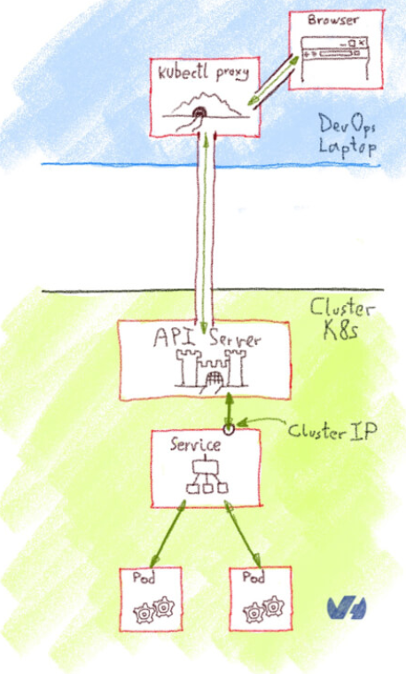
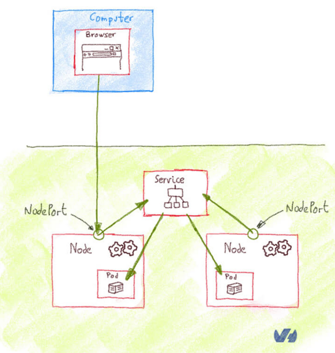
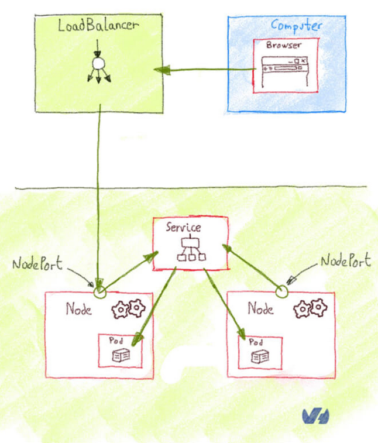
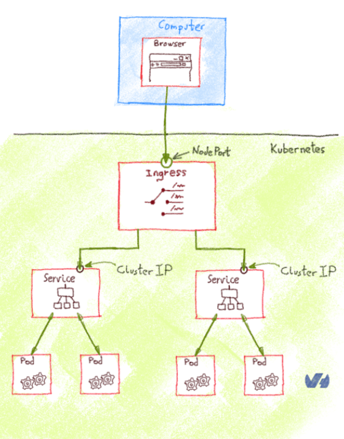

# Kubernetes Networking

!!! Remark
    Credit for all these beautiful image is the [OVH article at this Url](https://blog.ovhcloud.com/getting-external-traffic-into-kubernetes-clusterip-nodeport-loadbalancer-and-ingress/)  
    Image are generally more clear than long explanation :Angel:

## ClusterIP

All pods are reachable thru a service. By default a service is an internal IP named ClusterIP.
You can reach this IP:
* Internally from another pod, for instance a busybox instance
* Externally using the Kubectl proxy command (but suitable only for development)

This schema summarize this second approach:  

!!! Remark
    Pods Cidr & Service network Cidr are strictly separated

!!! Important
    Never try to test a network service with a ping - it won't work  
    Test it using one of the following tool: wget, curl, netcat ...

## NodePort

Nodeports allows to expose permanently an internal port.  
Once declared, **Nodeport are reachable on all Worker nodes**

This schema shows the NodePort concept:

## LoadBalancer

Nodeport are bound to each node and are statically adressed by external client (Browser for instance)  
To Load balance access to node ports from an external application, you need to create a **Load balancer Ip**.  

This schema shows the Load Balancer concept:

!!! Remark
    Exposing service on a Load balancer IP is a Cloud provider proposed feature (EKS, AKS, GKE, ... )  
    Even if it's practical, you have to pay for each fixed IP provided even if you ask for an internal IP (and not a public exposed IP)  
    To bypass this constraint, you may deploy an internal Kubernetes rounting service named "Ingres Controler"  
    We will see an example of this later based on "Traefik".

!!! Tip
    Even on a Private Cloud, you can integrate your own Load Balancer  
    [MetalLB is an example of such possibility](https://metallb.universe.tf/)  
    You need to book some IPs in your Infrastructure for this usage.

## Ingress Controler

As explained just above, Ingress Controler allows to route call to a bunch of internal services using naming routing ( prefix based, regex based ...)  

The main advantages are:
* Reduce the need for Load Balancer
* Allows masquerading the internal Url naming by presenting external names for API
* Do some pre-processing before routing to internal services (Authorization for instance)

This schema shows the Ingress Controler concept:

## Service Mesch

Service mesch are the possibility to manage service access by adding high value features like:
* Canary release
* A/B testing ( exposing 2 differents Web sites to 2 different users group)
* Rate limiting
* Access Control
* end-to-end authentication (by injecting SSL )

Well known service mesch are [Istio](https://istio.io/) and [Linkerd](https://linkerd.io/).  
