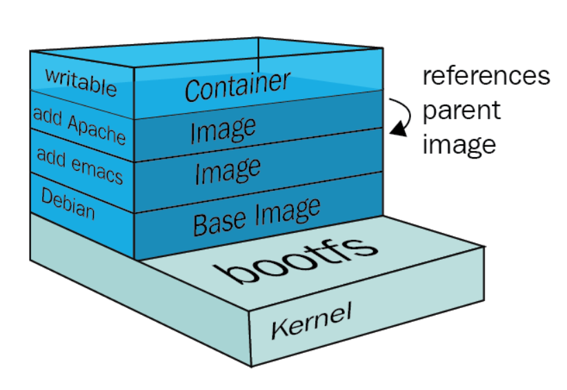
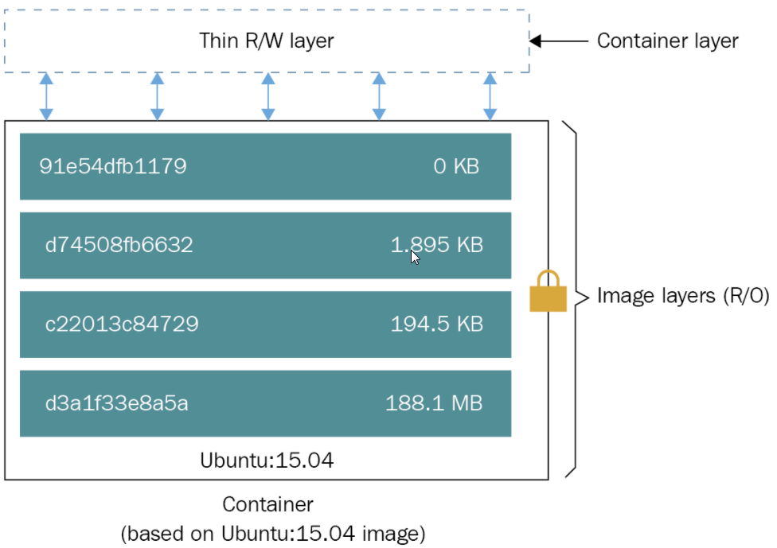
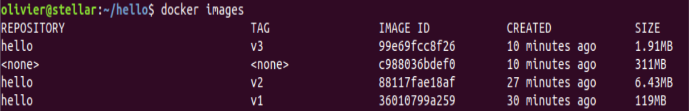

# Docker basics and a bit more

Virtualbox required under Windows7 
not under windows10 if you use the native virtualization

# Installation
Depends on the OS.
* Windows:	https://docs.docker.com/docker-for-windows/
* Mac:      https://docs.docker.com/docker-for-mac/
* {{=Linux=}}:    https://docs.docker.com/engine/install/


!!! Tips 
    If under Linux you don't have the right to execute Docker under your user account
    In that case, you need this:
    ````
      sudo usermod -aG docker $( whoami )
    ````

When docker is installed, a good starting point is this command:
````
docker info
````
This give you details around version and embedded plugins

# Image and runtime

Dockerfile
````
FROM ubuntu
RUN apt-get update && apt-get install -y nginx
COPY index.html /var/share/nginx/html
CMD nginx -g "daemon off";
````


# Network

There are several network drivers :
* {{=bridge=}}: This is the default non routable network - adress 17.2.17.0.2. Used for standalones application
* host : The container is using the host network
* macvlan: A MAC address is dedicated to the container
* {{=overlay=}}: Virtual Embedded network added to the host network allowing containers communication (used in Kubernetes)
* None: Deactivated network

To see the default network, type a command like this one :
````
docker run -ti nginx bash -c "hostname -i"
````

To be able to use the internal network:
````
docker run -d -p 8087:80 nginx
````

Otherwise, with a host network:
````
docker run -d --net=host nginx
````
We will not enter in deep on complex options ...

# Data Storage



The most common storage drivers are AUFS, Overlay/Overlay2, Devicemapper, Btrfs, and ZFS. 
All storage drivers can be categorized into three different types:

Storage driver category     | Storage drivers 
----------------------------|-----------------
Union filesystems           | AUFS, Overlay, Overlay2
Snapshotting filesystems    | Btrfs, ZFS
Copy-on-write block devices | Devicemapper



### Bind mounts

A simple and traditional way for data sharing between a host and guest :
```
docker run  --rm -ti --volume /home/ubuntu/foo:/foo alpine sh
```

!!! Warning:
    Security leak as we are accessing the host volume 
    Not portable

Better option, binding mounts using Volumes

````
docker run --name foo -ti --volume /foo alpine sh
docker run --name bar -ti --volumes-from foo alpine sh
````

We can see the volume with these commands :

````
docker info|grep "Docker Root Dir"
Docker Root Dir: /var/snap/docker/common/var-lib-docker
sudo ls -als /var/snap/docker/common/var-lib-docker

docker volume ls
````

# Public registry

# Private registry

Private registries are used for On Premise deployment.
Some common private registry : Nexus or Jfrog Artifactory

To use a private registry you need to deploy some private cerficate on your Docker client.
Some commands may be restricted - it depends on the server configuration ( "docker search" forbidden for instance)

When you are in a corporate company, your Docker build may rely on remote internet registries
you will need a proxy to build new images.
Several options in front of you:

* Transparent proxy usage
* Add proxy options to your build like
```
--build-args PROXY=proxy.fr.myCompany:8080
```  
* Proxy in the daemon docker configuration
* Or (best option) your private registry is doing the proxy for you


# Build image - Slimming stage

## Code to deploy

helloworld.go :

```go
package main
import "fmt"
func main() {
fmt.Println("Hello, world!")
}
```
Build :
```
env GOOS=linux GOARCH=amd64 go build
```

## Beginner

Dockerfile:
```
FROM ubuntu:xenial
COPY hello hello
ENTRYPOINT ["./hello"]
```

What is the issue there ?

## Intermediary level

Dockerfile:
```
FROM alpine:3.8
COPY hello hello
ENTRYPOINT ["./hello"]
```

Much better ...

## Seasoned integrator

Dockerfile using “stage” builds

````
# Step 1
FROM golang:alpine3.7 as build-env
COPY main.go hello/main.go
WORKDIR hello
RUN env GOOS=linux GOARCH=amd64 go build

# Step 2
FROM scratch
COPY --from=build-env /go/hello/hello /go/bin/hello
ENTRYPOINT ["/go/bin/hello"]
````

* My Dockerfile becomes a CI tool 
* ... and the size is reduced to the max !

