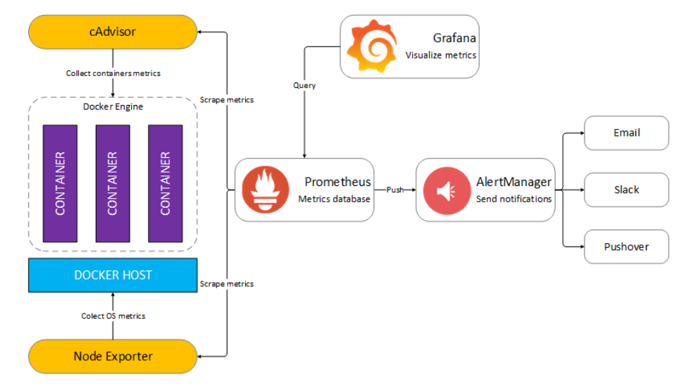

# Docker compose

Compose is a tool for defining and running ==multi-container Docker applications==. 
With Compose, you use a ==YAML== file to configure your application’s services. 
Then, with a single command, you create and start all the services from your configuration

## Links

* [Overview of Docker compose](https://docs.docker.com/compose/)
* [Docker compose release](https://github.com/docker/compose/releases)
* [Quickstart: Compose and WordPress]( https://docs.docker.com/compose/wordpress/]  )

## Labs 1: Wordpress

Please follow the "Compose and Wordpress" quickstart.

## Labs 2: A complete monitoring infrastructure

We will deploy this :

The project URL is this one : [dockprom](https://github.com/stefanprodan/dockprom)

!!! Warning:
    Before deploying we will do a snapshot of our machines

We will deploy :
* the whole infrastructure on "ROSmaster" machine
* the Host monitoring agent on "ROSworker1" machine 
