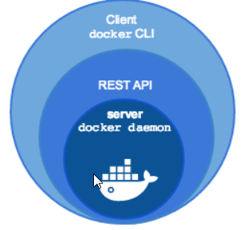
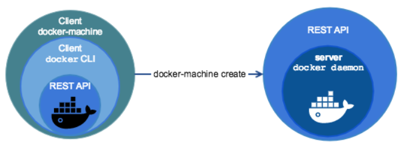
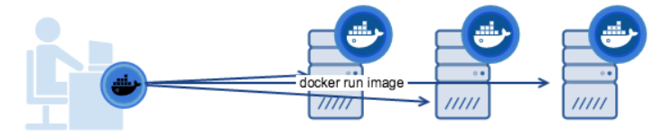

# What is Docker machine ?

## Docker engine

When people say “Docker” they typically mean ==Docker Engine==, the client-server application made up of the Docker daemon, a REST API that specifies interfaces for interacting with the daemon, and a command line interface (CLI) client



## Docker machine

==Docker Machine== is a tool for provisioning and managing your Dockerized hosts (hosts with Docker Engine on them)



The Dockerized hosts themselves can be thought of, and are sometimes referred to as, managed “machines”.



## Why using Docker Machine ?

* We want an efficient way to provision machine with Docker pre-installed
* We want a small (in size) Docker enabled OS (Ubuntu 12.04.x is the default)

## Installation

Follow: [Docker machine installation link](https://github.com/docker/machine/releases)

``` bash
$ if [[ ! -d "$HOME/bin" ]]; then mkdir -p "$HOME/bin"; fi && \
curl -L https://github.com/docker/machine/releases/download/v0.16.2/docker-machine-Windows-x86_64.exe > "$HOME/bin/docker-machine.exe" && \
chmod +x "$HOME/bin/docker-machine.exe"
```

!!! Important
    To play the above script, you will need {==git-bash==}

## Why RancherOS ?

^^Several reasons :^^ :thumbsup:

* This is because [Rancher](https://rancher.com/) is a ==cool== company delivering ==KISS==[^1] cloud tools

* For Kubernetes, we will see 2 good ==On Premise==[^2] Rancher tools

    * ==K3S== a very light kubernetes dedicated to ==Edge==[^3] Computing
      It really nice as you can start really easily a Kubernetes cluster on Raspberry PI

    * ==RKE== (Rancher Kubernetes Engine) the professional Kubernetes packaging easy to use

  [^1]: Keep It Simple and Stupid
  [^2]: "On Premise" means "private", we can say also "In House"
  [^3]: Edge computing could be seen as a micro Data center (IOT / 5G)


!!! note
    Another very cool company you should have a look to: [Hashicorp](https://www.hashicorp.com/)

    Example of nice products: vagrant, packer, terraform, vault


## Links

* [ RancherOS release](https://releases.rancher.com/os/latest/rancheros.iso)
* [ Rancher OS installation with dockerMachine](https://rancher.com/docs/os/v1.x/en/installation/workstation/docker-machine/)
* [ Rancher OS overview](https://rancher.com/docs/os/v1.x/en/overview/)


## LABS: Installing RancherOS machines

They are several objectives behind this LAB
* Show you another virtual machine deployments
* Explore and understand another modern packaging
* Have machines ready to test docker
* Have machines ready for a future Kubernetes cluster

### Instruction
You need to install 2 machines named "ROSServer" and "ROSWorker1"

### Deployment instructions
To deploy a RancherOS machine, you will need this command. (you will have to adapt it)

```bash
$ docker-machine create -d virtualbox \
        --virtualbox-boot2docker-url https://releases.rancher.com/os/latest/rancheros.iso \
        --virtualbox-memory <MEMORY-SIZE> \
        <MACHINE-NAME>
```

!!! Warning
    Use ==Git Bash== to execute the following commands (**MobaXterm** won't work well here)

To check the VM are deployed:

```
$ VBoxManage list runningvms | grep <MACHINE-NAME>
```     

### Understand the installation

!!! Example "Your turn"
    Ask you some questions about the driver interface created ?

    - [x] What are the interface type ?
    - [x] Could you check your networks possibility ?
    - [x] Pinging machine (from your localhost, between the machines)
    - [x] Access to internet ?


!!! Tip
    To start the VirtualBox guest addition:

    ```bash
       ros service enable virtual-box 
       ros service start virtual-box
    ```

    You need to reboot the VM to really activate the service

## RancherOS commands summary

|COMMAND       |DESCRIPTION                                                      |
|--------------|-----------------------------------------------------------------|
|docker        | Good old Docker, use that to run stuff.                         |
|system-docker | The Docker instance running the system containers. (root rights)|
|ros           | Control and configure RancherOS                                 |

## LABS: machine setup

### Changing console
The machine is particular there is by default no persistence on the OS console
You can see the available console with:

```
ros console list
```

Change to ubuntu:

```
ros console switch ubuntu
```
You will have to restart the session

Now you will get data persistence in your home like a traditional OS

### Adding git for future labs
We will need to have "git" on the machine

```bash
# Add this alias to a ~/.bash_profile
alias git='docker run -ti --rm -v /home/docker:/git bwits/docker-git-alpine'
```

!!! note
    As you can see everything is docker ... :smiley: !

### Adding docker compose
Before switching to kubernetes we would like to deploy complex things with docker.
Let prepare the installation of docker-compose

```
sudo wget https://github.com/docker/compose/releases/download/1.27.4/docker-compose-$(uname -s)-$(uname -m) -O /usr/bin/docker-compose
sudo chmod +x /usr/bin/docker-compose
```

### Adding your own private key
Use ==ssh-keygen== command to add a private/public rsa key - so you can easily connect to your machine. (from MobaXterm for example)

!!! Tip
    ```
    Host rosserver
    HostName 127.0.0.1
    User docker
    Port 2222
    UserKnownHostsFile /dev/null
    StrictHostKeyChecking no
    PasswordAuthentication no
    IdentityFile ~/.ssh/id_ros_rsa
    IdentitiesOnly yes
    LogLevel FATAL

    Host rosworker1
    HostName 127.0.0.1
    User docker
    Port 2223
    UserKnownHostsFile /dev/null
    StrictHostKeyChecking no
    PasswordAuthentication no
    IdentityFile ~/.ssh/id_ros_rsa
    IdentitiesOnly yes
    ```

