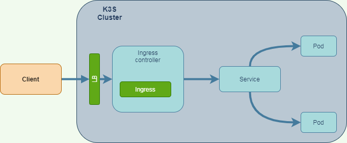
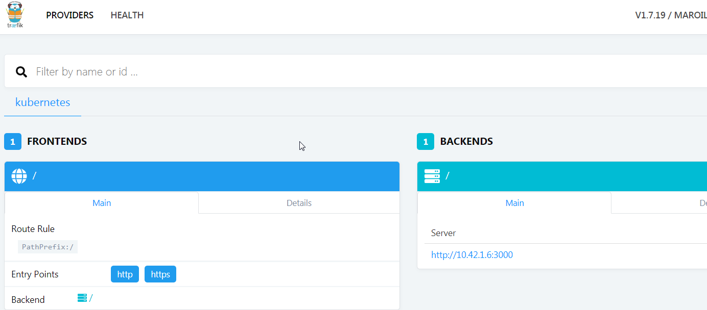

# Kubernetes Advanced

Ok we will continue with our K3S cluster

## Kubernetes dashboard
Just for fun, we will deploy the Kubernetes dashboard
This will also introduce some concepts related to security in Kubernetes 

[Official documentation is here](https://rancher.com/docs/k3s/latest/en/installation/kube-dashboard/)

### Deploy the dashboard
```bash
GITHUB_URL=https://github.com/kubernetes/dashboard/releases
VERSION_KUBE_DASHBOARD=$(curl -w '%{url_effective}' -I -L -s -S ${GITHUB_URL}/latest -o /dev/null | sed -e 's|.*/||')
sudo k3s kubectl create -f https://raw.githubusercontent.com/kubernetes/dashboard/${VERSION_KUBE_DASHBOARD}/aio/deploy/recommended.yaml
```

### Deploy service account and role
Dashboards are created in a dedicated namespace `kubernetes-dashboard`
Access control in Kubernetes is managed by a feature named RBAC for Role Based Authentication Control.
We need to have service account to access the dashboard.

File `admin-service-user.yaml`:
```yaml
apiVersion: v1
kind: ServiceAccount
metadata:
  name: admin-user
  namespace: kubernetes-dashboard
```
For this user to have full access to the dashboard in namespace `kubernetes-dashboard`, we need to give a cluster role access.
File `admin-user-role.yaml`:
```yaml
apiVersion: rbac.authorization.k8s.io/v1
kind: ClusterRoleBinding
metadata:
  name: admin-user
roleRef:
  apiGroup: rbac.authorization.k8s.io
  kind: ClusterRole
  name: cluster-admin
subjects:
- kind: ServiceAccount
  name: admin-user
  namespace: kubernetes-dashboard
```
To create the resources :
```
create -f admin-service-user.yaml admin-user-role.yaml
```
This is Ok, but how to see the dashboard ? 
One solution we have seen so far is to expose the service port with the `NodePort`.
This is not the best option, but let use it ...
```
kubectl edit svc kubernetes-dashboard -n kubernetes-dashboard
```
There you may change the `type: ClusterIP` to `type: NodePort`. Save it. You are done.
You can see the external port with this command :
```
vagrant@box1:~$ kubectl get svc kubernetes-dashboard -n kubernetes-dashboard
NAME                   TYPE       CLUSTER-IP     EXTERNAL-IP   PORT(S)         AGE
kubernetes-dashboard   NodePort   10.43.206.84   <none>        443:31123/TCP   37m
```
In this example, you see the port is `31123`
Ok - you are almost done ...
You need first get the `admin-user` authentication **token** by this command:
```
kubectl get svc kubernetes-dashboard -n kubernetes-dashboard
```
There are standard authentication token as you can see on https://jwt.io/
You so can see the kubernetes dashboard opening your browser to `https://localhost:31123`

## Routing service with ingress

So we have installed a K3S Kubernetes that comes with pre-installed feature.
One is the reverse proxy [Traefik] (https://doc.traefik.io/traefik/)

From the documentation:
> Traefik is an open-source Edge Router that makes publishing your services a fun and easy experience. It receives requests on behalf of your system and finds out which components are responsible for handling them.

Directing traffic from external clients to the containers within the cloud, while ensuring the external client remains agnostic to the cloud, is a recurring problem. 
A common solution is to create an **ingress controller**.
The ingress controller is delegated the responsibility of taking incoming traffic from an external client, and determining to which container the traffic should be directed.



### Terminology

**term**       | **Meaning**  |
---------------|--------------|
|Ingress| A Kubernetes Ingress exposes HTTP and HTTPS traffic from outside the Cluster to Services within the cluster.|
|Ingress Controller| An application that is responsible for fulfilling Ingress requests.|
|Service| A Kubernetes Service is an abstract way to expose an application running in a set of Pods. Implementations of a Service include NodePort and ClusterIP.|

### Configuring Traefik dashboard
K3s creates a `Traefik` deployment for the Ingress Controller, but by default, the dashboard is disabled. 
Running `Traefik` with the dashboard enabled materializes the concept of routing rules

!!! warning "Enabling Traefik dashboard"
    **The ConfigMap for Traefik must be edited to enable the dashboard**
    ```
    kubectl -n kube-system edit cm traefik
    ```
    just after the entry [Trafic_log], add this
    ```
    [api]
    dashboard = true
    ```
    You need to restart Traefik:
    ```
    kubectl -n kube-system scale deploy traefik --replicas 0
    kubectl -n kube-system scale deploy traefik --replicas 1
    ```
    You must expose the Dashboard port:
    ```
    kubectl -n kube-system port-forward deployment/traefik 8089:8080
    ```
    !!! Note
        Port forward is another method to access to an application inside the cluster
        Open the dashboard in your browser at http://localhost:8089. 
        our routing rules will show up on this dashboard as you create Ingress.
        
    !!! warning 
        The port forward of port in Network virtualbox will not work in that case,
        you need to use a SSH forward like
        Localforward 8089 127.0.0.1:8089

### Configure Traefik Routing Rules

From the Git resource https://github.com/omerlin/yncrea-virtualization-labs.git, go to Kubernetes Ingress directory

#### Create a deployment

This is the helloworld deployment we have seen Day 2.
```
kubectl create -f deployment.yml
```

#### Create a service
Instead of using the `kubectl expose` command, we declare the service explicitly.
File `service.yml`
```yaml hl_lines=11
apiVersion: v1
kind: Service
metadata:
  name: helloworld-svc
spec:
  ports:
    - name: http
      port: 3000
  selector:
    # apply service to any pod with label app: helloworld
    app: helloworld
```
!!! note
    The service mapp application with the label: `app: helloworld`

#### Create a service

The Ingress configures Traefik with routing rules. 
This minimal example will use a path based routing rule. 
A path based routing rule is evaluated by inspecting the incoming url’s context. 
Here, the path is / with pathType: Prefix. The path / captures all incoming traffic

```
apiVersion: extensions/v1beta1
kind: Ingress
metadata:
  name: helloworld-ingress
  annotations:
    kubernetes.io/ingress.class: traefik
spec:
  rules:
  - http:
      paths:
      - path: /
        pathType: Prefix
        backend:
          serviceName: helloworld-svc
          servicePort: 3000
```


