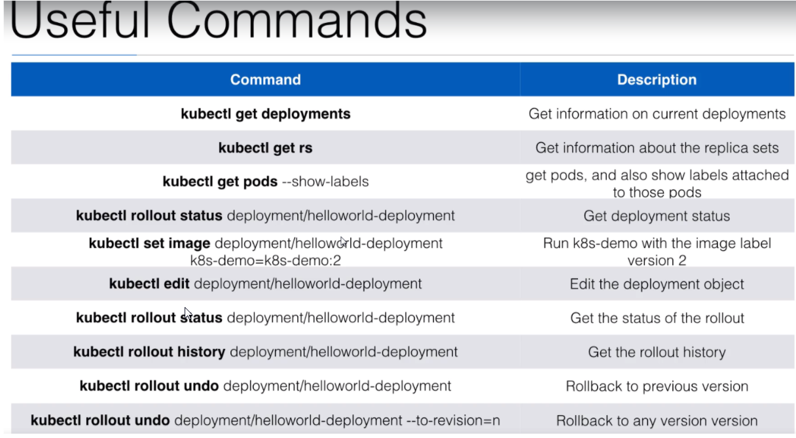

# Kubernetes basics
 
## Global architecture
### Worker node architecture

## Replication controller & replication set
### Stateless Vs Stateful

If your application is ==stateless==, you can horizontally scale it

* ==Staleless== = your application don't have a state, it doesn't write any local files/ keep local session
* ==Stateful== All traditional database (PostgreSQL, MySQL) are ==stateful==, they have database files that can't be split over multiple instance

!!! Note
    This is a big difference with NoSQL database, like Cassandra, where scalability is possible - but the database is no more ACID
    See also the [CAP theorem]'(https://en.wikipedia.org/wiki/CAP_theorem)

- Most Web application can be made stateless:

  * [x] Session management must be done outside the container
  * [x] Any files that need to be saved **can't be saved locally** on the container
  
### Scaling in Kubernetes

* ==Scaling== in Kubernetes can be done using the --**Replication Controller**-- / ==Replication Set==

!!! Note
    Replication Set is now replacing Replication Controller has this is able to do filtering based on a set of values
    whereas the Replication Controller was able only to use equality (like "card" == "GPU")
    ==Replication== Set are used in background by ==deployment==

- A "replication set" will **ensure** a number of ==pod replicas== will run at all time
- A pod stared with the ==replica set== (replica controller) will automatically be replaced if they fail, get deleted or are terminated.  
- Using a ==replicat set== is also recommended if you just want to ensure ==1 pod== is **always running**, even after reboot

  * [x] in that case, you configure with ==replica=1==
  * [x] You are sure that the pod is always running
  
## Deployment

- Deployment declaration in Kubernetes allows you to do ==deployments== and ==**updates**== 
- When doing a deployment, you define the ==state== of your application
  
  * then Kubernetes will ensure the cluster will match your ==desired state==
  * This would be difficult to achieve with Replication Controller / Replication Set
  
So the Deployment Object is easier to use and givers more possibilities

```yaml hl_lines="2 4"
apiVersion: apps/v1
kind: Deployment
metadata:
  name: helloworld-deployment
spec:
  replicas: 3
  selector:
    matchLabels:
      app: helloworld
  template:
    metadata:
      labels:
        app: helloworld
    spec:
      containers:
        - name: k8s-demo
          image: omerlin/nodeapp:v01
          ports:
            - name: nodejs-port
              containerPort: 3000
```
### Useful commands



### `LAB` deployment

> We will use K3s for this lab
> please follow the instruction on the page [] 


