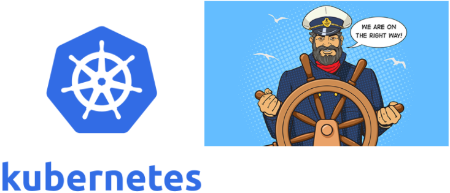

# Kubernetes introduction

## What is Kubernetes?
To begin to understand the usefulness of Kubernetes, we have to first understand two concepts: 
{=immutable infrastructure=} and {=containers=}.

* {==Immutable infrastructure==} is a practice where servers, once deployed, are never modified.
  If something needs to be changed, you never do so directly on the server. 
  Instead, you’ll build a new server from a base image, that have all your needed changes baked in. 
  This way we can simply replace the old server with the new one without any additional modification.
* {==Containers==} offer a way to package code, runtime, system tools, system libraries, and configs altogether.
  This shipment is a lightweight, standalone executable. 
  This way, your application will behave the same every time no matter where it runs (e.g, Ubuntu, Windows, etc.). 
  Containerization is not a new concept, but it has gained immense popularity with the rise of microservices and Docker.

Armed with those concepts, we can now define Kubernetes as a {=container or microservice platform=} 
that ==*orchestrates*== computing, networking, and storage infrastructure workloads. 
Because it doesn’t limit the types of apps you can deploy (any language works), Kubernetes extends how we scale containerized applications 
so that we can enjoy all the benefits of a truly {==immutable infrastructure==}. 
The general rule of thumb for K8S: **"if your app fits in a container, Kubernetes will deploy it."**

!!! info
    
    By the way, if you’re wondering where the name “Kubernetes” came from, it is a Greek word, 
    meaning **helmsman** or **pilot**. 
    The abbreviation ==K8s== is derived by replacing the eight letters of “ubernete” with the digit 8.

The Kubernetes Project was open-sourced by Google in 2014 after using it to run production workloads at scale for more than a decade. (Borg project) 
Kubernetes provides the ability to :

* run dynamically scaling, containerised applications,
* utilising an API for management. 
  
Kubernetes is a :

* {==vendor-agnostic==} (no lock-in) container management tool, 
* minifying cloud computing costs whilst simplifying the running of resilient and scalable applications.

Kubernetes has become {==**the standard**==} for running containerised applications in the cloud, 
with the main Cloud Providers (AWS, Azure, GCE, IBM and Oracle) now offering managed Kubernetes services.

| Provider    | Kubernetes offer              |
| :---------- | :---------------------------- |
| `AWS`       | EKS  |
| `Azure`     | AKS  |
| `GCE`       | GKE  |
| `IBM`       | IBM Cloud Kubernetes Service  |
| `Oracle`    | OKE  |

## Kubernetes basic terms and definitions
To begin understanding how to use K8S, we must understand the objects in the API. 
Basic K8S objects and several higher-level abstractions are known as controllers. 
These are the building block of your application lifecycle.

### Some Basic objects :

* {==Pod==}. A group of one or more containers.
* {==Service==}. An abstraction that defines a logical set of pods as well as the policy for accessing them.
* {==Volume==}. An abstraction that lets us persist data. (This is necessary because containers are ephemeral—meaning data is deleted when the container is deleted.)
* {==Namespace==}. A segment of the cluster dedicated to a certain purpose, for example a certain project or team of devs.

###Some Controllers, or higher-level abstractions:

* {==ReplicaSet (RS)==}. Ensures the desired amount of pod is what’s running.
* {==Deployment==}. Offers declarative updates for pods an RS.
* {==StatefulSet==}. A workload API object that manages **stateful** applications, such as databases.
* {==DaemonSet==}. Ensures that all or some worker nodes run a copy of a pod. 
                 This is useful for daemon applications like Fluentd, Logstash, Node Exporter ...
* {==Job==}. Creates one or more pods, runs a certain task(s) to completion, then deletes the pod(s).

### Other concepts:

!!! info ""
    `Images` : Typically a docker container image – an executable image containing everything you need to run your application; application code, libraries, a runtime, environment variables and configuration files. 
               At runtime, a container image becomes a container which runs everything that is packaged into that image.

!!! info ""
    `Micro services`: A specific part of a previously monolithic application. A traditional micro-service based architecture would have multiple services making up one, or more, end products. 
                      Micro services are typically shared between applications