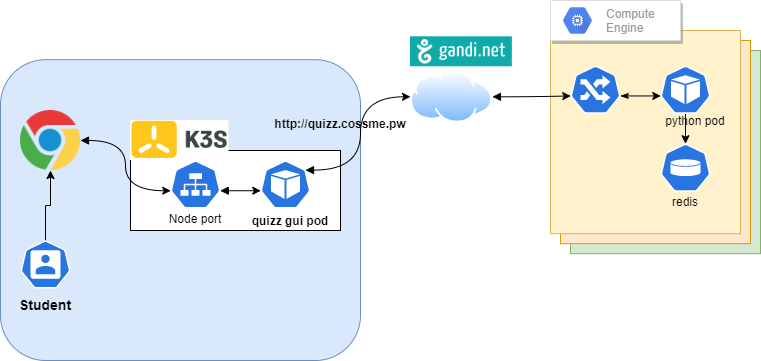

# Quizz time 
You are now under pressure ...but don't panic ... 
This is not difficult (less than what we have seen so far)

## Architecture


## Your examination

### Summary
You install a client Quizz frontend application and then you execute the Quizz

### Detail
The application is in the `quizz` subdirectory of the [Yncrea virtualization labs](https://github.com/omerlin/yncrea-virtualization-labs.git)
So you need to do a :

```
git pull
```

You will need to build your own docker Python container locally.
This means you will have to create a `Dockerfile`.

!!! warning
    The difficulty here is to find the dependencies
    If you know python it's quite easy. 
    You can try to launch the application locally with Python for instance.

* Then you will publish this container to your own account on http://hub.docker.com
* Then you create the manifest Yaml file to deploy this container as a pod on your K3S cluster.
* Having done this you will need to access the service port to launch a Quizz.

Something like:
http://localhost:34600/quizz

You execute the quizz until the end ..., and you are done !

### Information about this small application
You have requirements on Python to manage.
Your container expects the file `config.yml` to be in the directory `/etc/quizz`

!!! important
    you need to change your `user` name in the `config.yml` with **your Yncrea email**.

!!! info    
    Information are exchanged with the server located on http://quizz.cossme.pw

### alternative
You can simply deploy on Docker as this is a very simple application ...
... But be aware you loose 3 points doing that ... K3S deployment is the right way to go.
