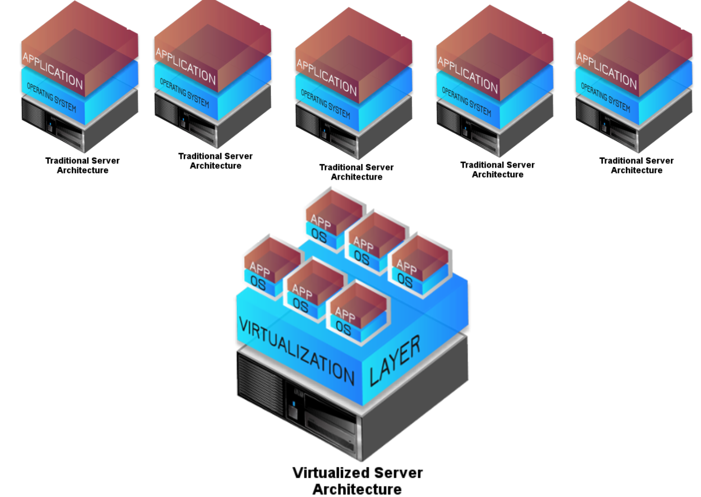

# The "long" story of virtualization ...
## What and why

Main reasons to adopt virtualization fot IT administrators & Management
* Average 5-10 % of real resources used on traditional HW
* Hardware failure
* Single OS on top of Hardware

IT managers duties:
* Security
* Hw & Sw maintenance
* Hw Cooling and power management

Where are we ?
Where are we going ?
Some tremendous questions about the future of virtualization