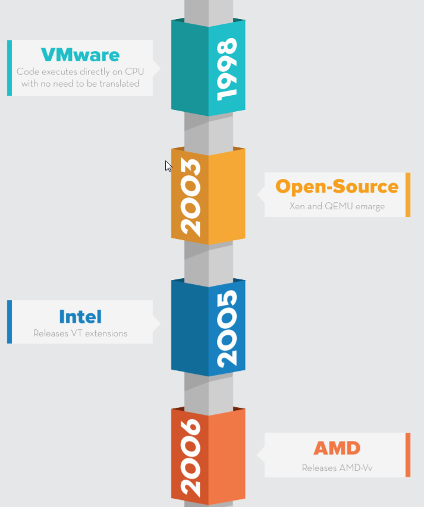
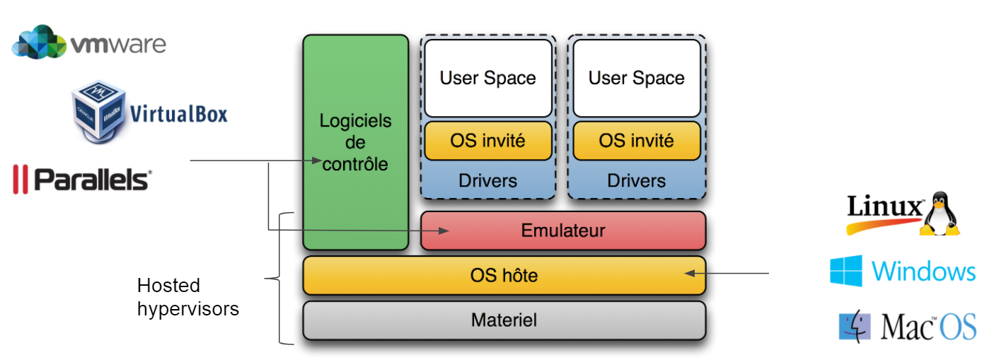
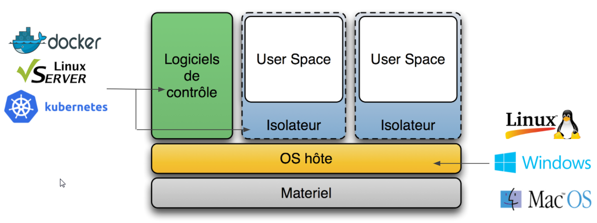

# The "long" story of virtualization ...
## What and why

Main reasons to adopt virtualization fot IT administrators & Management

* Average 5-10 % of real resources used on traditional HW
* Hardware failure
* Single OS on top of Hardware

IT managers duties:

* Security
* Hw & Sw maintenance
* Hw Cooling and power management

## Where are we ?

In the late 1990s, VMware introduced a technology that enabled most of the
code to execute directly on the CPU without the requirement for translation
or emulation.

The concept of the “hypervisor” – a platform upon which IT could create and run virtual machines
comes from Mainframes

For years, VMware and its patents ruled the realm of virtualization. On the server side, running on bare metal,
VMware's ESX became the leading Type 1 (or native) hypervisor. 
On the client side, running within an existing desktop operating system, VMware Workstation was among the top Type
2 (or hosted) hypervisors.

Over the years, some interesting open-source projects emerged, including Xen and Quick EMUlator (QEMU). Neither was as fast or as
flexible as VMware, but they set a foundation that would prove worthy down the road. 
Around 2005, Advanced Micro Devices (AMD) and Intel created new processor extensions to the x86 architecture.
These extensions provided hardware assistance for dealing with privileged instructions.

Called AMD-V and VT-x by AMD and Intel respectively, these extensions changed the landscape, eventually opening server
virtualization to new players.

For more details on Xen and KVM: [Xen and KVM](https://blog.octo.com/presentation-des-hyperviseurs-xen-et-kvm/)

Even Microsoft eventually got into the game with the release of Hyper-V in 2008. (Archi similar to Xen)

When virtualization essentially became free, or at least accessible without expensive licensing fees,
new use cases came to light.
Most notably, Amazon began to use the Xen platform to rent some of its excess computing capacity to thirdparty customers.
Through their application programming interfaces (APIs), Amazon kicked off the revolution of elastic cloud computing, where the applications could self-provision resources to fit their workloads.

Progressively, open-source hypervisors have matured and become pervasive in cloud computing.
Technology vendors developing solutions for virtual environments are increasingly required to support all major hypervisors (Xen and KVM)

With this hypervisor parity, innovation became focused on the private/public cloud hardware architectures and the software ecosystems that surround them: storage architectures, softwaredefined networking, intelligent and autonomous orchestration, and
application APIs. 
This leads to new actors like Nutanix ant its HCI (Hyper Convergence Infrastructure) to emerge.

Legacy server applications are slowly retiring to give way to elastic, self-defining cloud applications (although they will coexist side by side for some time).

## Server and Desktop Virtualization

{==Desktop Virtualization==} is a response to increasing numbers of employees working remotely and from multiple devices.

{==Server virtualization==} is an answer for companies that need to diversify workloads and maximize server efficiency

## Terminology

Hardware Abstraction Layer

Host Operating System

Guest Operating System

Partitioning, isolation, sharing of resources

Images lifecycle

Virtual Network

## Hypervisors

A hypervisor provides software to manage virtual machine access to the underlying hardware. The hypervisor creates, manages, and monitors virtual machines.
There are 2 types: {==Type 1 (Bare metal)==} and {==Type 2 (Hosted)==}.
Hypervisors come with Management Software that:

* Controls the failover
  
* Authorize dynamic over-allocation of resources (Type 1 only, can specify static too)
  
* Manages the VMs lifecycle (start/stop)
  
* Manages the VMs images location (lift and shift)

!!! note
    The term **Lift and Shift** is used for migration from OnPremise Infrastructure to Cloud Infrastructure
    Another approach is **Transform and Move**

## Type 1 Hypervisor

!!! info
    Citrix Xen Server (free), 
    VMware vSphere (former VMware ESXi and VMware ESX), 
    Microsoft Hyper-V Server, Parallels Server Bare Metal, Oracle vm server (free).

## Type 2 Hypervisor

!!! info
    Microsoft (Microsoft VirtualPC, Microsoft Virtual Server), 
    Parallels (Parallels Desktop, Parallels Server), 
    Oracle VM VirtualBox (free), 
    VMware (VMware Fusion, VMware Player, VMware Server, VMware Workstation), 
    free (QEMU : x86 emulator), 
    KVM (free)

## Containers

!!! info
    Linux-VServer (isolating processes into user spaces) ; 
    chroot (isolating the change of root) ; 
    BSD Jail ; 
    LXC : free; 
    Docker.
