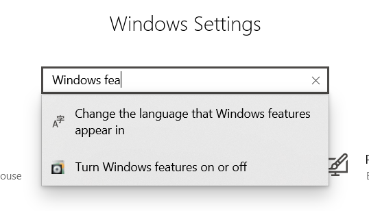
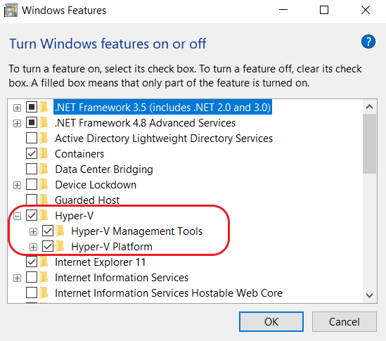
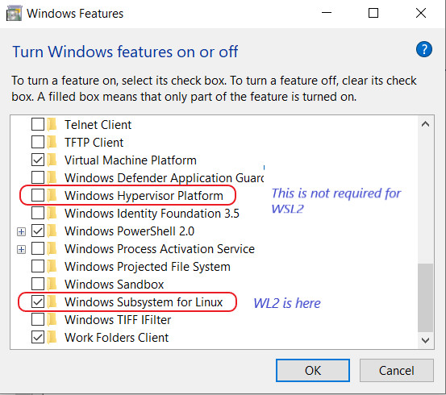

# Windows prerequisites

Since Windows 10, we have the possibility to activate a **Windows SubSystem based on Linux** (WSL).  

* **WSL 1** was activated using Hyper-V (The Layer 1 Windows virtualization).   
* **WSL 2** has arrived and could be more seen as an embedded container using Hyper-V librairies (and is no more an Hyper-V VM).
  - Hyper-V was also not working on Windows Home edition (which is quite a limitation !)

The idea behind is to have something leaner (lighter) and faster with performance optimization.  
I let you read around this topic in Microsoft official documentations (and other independent forum - but take care this is kinde jungle here )


!!! tip
    We configure WSL 2 to benefit from Docker Desktop
    While this is a cool feature and really simplifies a lot development it has some limitations too ... 
    This is why we will not focus only on it but first work on VirtualBox. 

!!! warning
    The Linux OS you install do not start a full subsystem (no init nor systemd scheduler)
    There are workaround of course - but this is something to put in place ( supervisord for instance )

The Wsl2 installation depends on your Windows version.

## Check your version of windows

```
winver
```

!!! warning
    Take care to use official documentations whenever you can because documentations and versions release are moving fast !
    And you have a lot of "bad" or "obsolete" information 

## if recent distribution

Recents means: Windows 10 version 2004 and higher (Build 19041 and higher) or Windows 11

The install is then automatic.  
[Install on recent Windows 10/11 distribution](https://docs.microsoft.com/en-us/windows/wsl/install)

## if older version 
... but not too old.  
You need at least: Windows 10 version 1909 (Build 18363 and higher)

[Install on Windows 10 distribution manually](https://docs.microsoft.com/en-us/windows/wsl/install-manual)

## Windows features activation

You can see windows features enabled in settings:


Hyper-V services must be activated:


WSL2 is activated:

