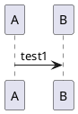

# Windows prerequisites

The Wsl2 installation depends on your Windows version.


Another example: 




```plantuml:test_2
A -> B: test2
```

```plantuml@gantt:test.4
[Prototype design] lasts 15 days
[Test prototype] lasts 10 days
```

```javascript
function dummy() {
  console.log('test')
}
```