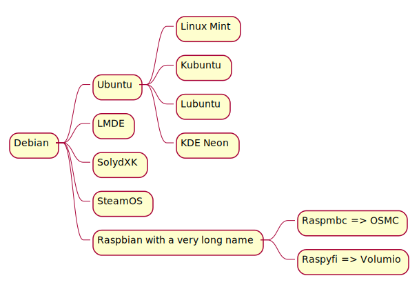
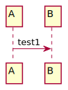
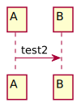
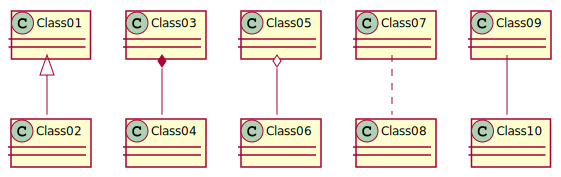

# Windows prerequisites

LF issue ?

The Wsl2 installation depends on your Windows version.




Another example: 

```plantuml:test1
A -> B: test1
```



```plantuml:test2
A -> B: test2
```




```plantuml:md-sample-class
Class01 <|-- Class02
Class03 *-- Class04
Class05 o-- Class06
Class07 .. Class08
Class09 -- Class10
```



```javascript
function dummy() {
  console.log('test')
}
```