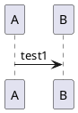

# Windows prerequisites

The Wsl2 installation depends on your Windows version.


Another example: 




```plantuml

A -> B: test2
```


```plantuml:md-sample-class
Class01 <|-- Class02
Class03 *-- Class04
Class05 o-- Class06
Class07 .. Class08
Class09 -- Class10
```


```javascript
function dummy() {
  console.log('test')
}
```