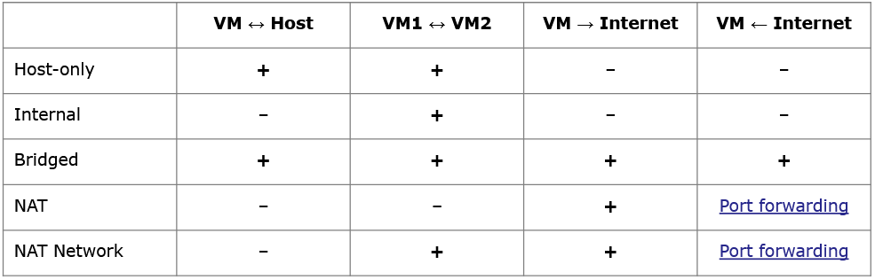
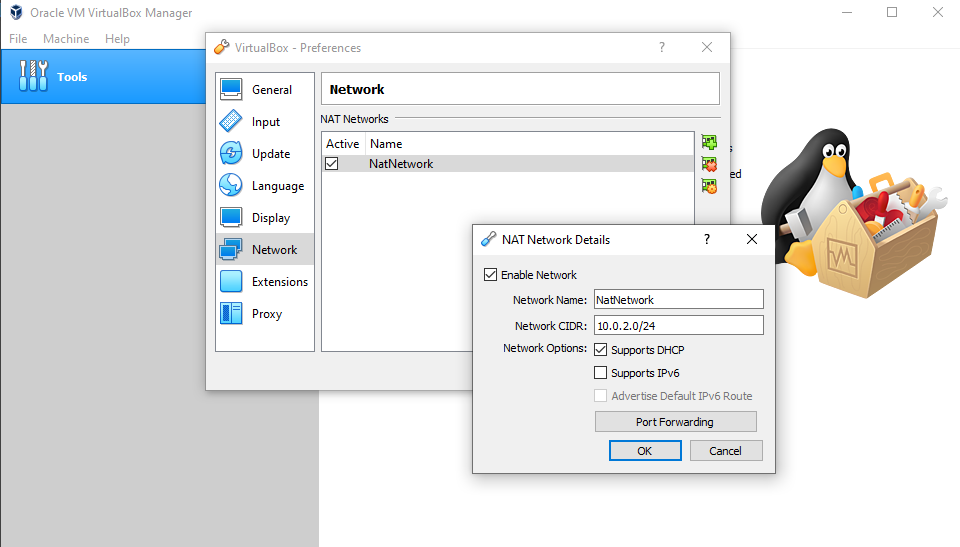

# Virtualbox software

## Virtualbox network configuration

Comes from [Virtualbox Network configuration](https://www.virtualbox.org/manual/ch06.html)

## Configure the NAT network

!!! Note
    10.0.0.0/8 IP addresses: 10.0.0.0 – 10.255.255.255 are reserved for private networks
    They are not routable on global internet